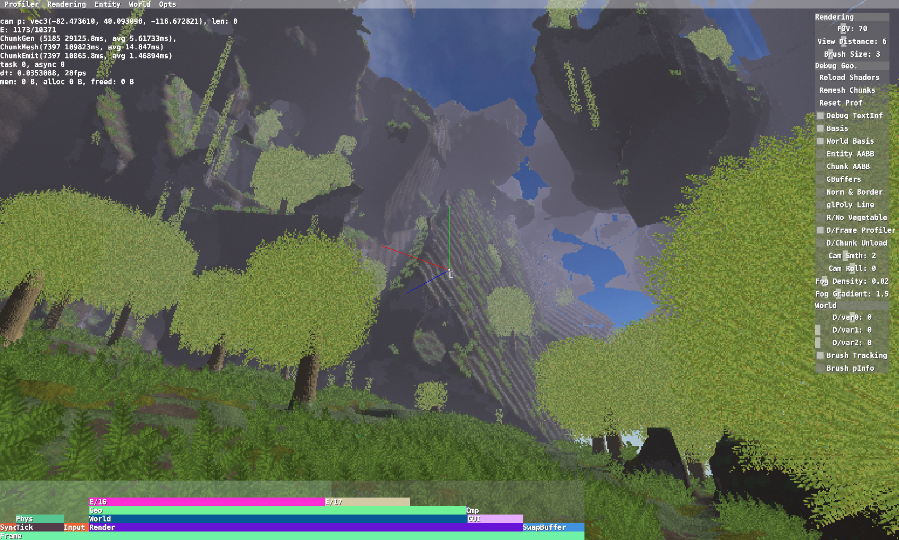

[comment]: <> (# Ethertia <small style="opacity: 80%">以太效應 <a href="https://elytra.dev/ethertia">[Site]</a><a href="https://github.com/Dreamtowards/Ethertia">[Src]</a><a href="https://elytra.dev/~pris">[Dev]</a></small>)

[comment]: <> ([![Linux]&#40;https://github.com/raysan5/raylib/workflows/Linux/badge.svg&#41;]&#40;https://github.com/raysan5/raylib/actions?query=workflow%3ALinux&#41;)

Ethertia / Building World while Interacting People / 建造 探索 互动 生存   

目标:
和挚友一起互动玩耍，坐火车，去剧场听DJ或看演出。建造喜欢的地方，学校，或幻想之地。
去领略大自然风光 深奥地形生成。

---

预览视频:

[comment]: <> (MinecraftFreedom + GTAVDetail + VRChatInteraction)

已完成:
- Surface Nets (Unified Grids) (基本平滑体素模型构建 Isosurface 对偶式等值面提取演算法)
- Multi-Material Terrain, 多材质地形 高度图边缘过渡，纹理映射
- Deferred Rendering 延迟渲染, Cubic Chunk 方形区块
- UDP 快速可-可靠网络通信 数据包 处理系统

需要做:  
- Reflection Mapping. 反射渲染 水面反射 或材质反射 (冰/汽车表面)
- SSAO. 环境光遮蔽 提高层次感
- Flat Atmosphere. 平面大气层渲染 基于半物理的天空散射&雾气
- Light Shaft. 光锥
- 一些特殊效果 盗梦空间的世界卷曲 虚拟实惊的万花筒扭曲 刺客信条的点阵世界表面

 

- WorldGen, Biomes. 地形生成 生物群系, 这是无底洞
- Voxel LoD 地形远处低细节等级，远景加载
- CSG, Advanced Modeling System. 更专业的建筑系统 实时构建更准确的建筑模型
- 农作物种植 马铃薯 胡萝卜 

 

- Multiplayer 多人游戏系统
- Skeleton Animation etc 骨骼动画 实时网络传输 穿戴定位器动作跟踪
- Vehicles 汽车 火车 地铁 船 直升机 霍金轮椅

特殊功能
- 和OBS/直播媒体流对接 让视频/音频流 连接到我们的国家顶级剧院和顶级环绕巨型音响, 
  以便看电影, 举办发布会, 大型DJ音乐节。也可以请乐器专家连接MIDI或初音未来的作曲 举办海边音乐会

想做的事：
- 建个巨型雕像 就像巴西山峰之巅/2b2t的那个 Cristo Redentor 雕像。温暖壮阔古典辉煌。
- 世界树之城。巨型的世界树 底下是古典小城市。藤蔓垂下 晚上树上发光。
- 海边音乐会。光锥大型灯光。国家顶级剧场 观影 看发布会 DJ。
- 建造我喜欢的学校。场所。
- 探索自然景观 海边峭壁 巨树密集 高耸奇幻悬崖

[comment]: <> (为什么很多地方用英文而不是中文？因为很多术语名/原名是英文，中文有时多义性/翻译误差。但是解释性文字)

 

### Credits

__Ethertia is developed by:__  
Game design, programming, graphics: [Eldrine Le Prismarine]()  
Music and sounds:  
Ingame artwork:   
Used libs&tools: cpp, glfw, glm, stb, bulletphys

### Build

- Working directory: `./run`
- Build shared-library and the program.   
  `cmake -DCMAKE_BUILD_TYPE=Release -G "CodeBlocks - Unix Makefiles" -DBUILD_SHARED_LIBS=1`  
  Will compile to: e.g. `./run/bin/macos-x86-64`

## Updates

### 22u49 @20221205 [.43]

- [ ] Atmosphere test.
- [ ] Fix NormAvg at Chunk Boundary, fail. cost lot, have bugs yet.
- [x] GuiScrollBox, Gui::gPushScissor()
- [x] misc: OBJLoader::saveOBJ(), Deferred Render Composer FBO. Mth::worldRay()

### 22u48 @20221129 [.68]

- [x] [.79] SurfaceNets Terrain, Unified Grids
  - FeaturePoint Evaluation, Naive Method.
  - 1 of 8 Voxel Material Determine. Distance Method.
- [x] [.71] Terrain Material Texturing with Triangle Blend & Height Map
- [x] [.63] Triplanar Normal Mapping.
- [x] [.54] Material Texture Atlas spec.
- [x] [.42] Framebuffer, gbuffer init.

- [x] [.63] Deferred Rendering
- [x] [.34] Specular Lighting via Roughness map.

### 22u41 @20221014 [.29]

- [x] [.42] PerFragment Material Texturing (single material out of greatest weight in the triangle.)

  

### 22u40 @20201006

  
_ps. marching cubes with kernel program generated vertex UVs._

- [x] [.62] Multiple Material Texturing (naive full-triangle material texturing).  
- [x] [.13] Gamemode creative/spectator (collision disabled, `/m_Gamemode <1/2/3>`), Fly mode (gravity disable).

---

<!--

## Roadmap

### Gameplay

Create, Explore, Survive.

- **Explore**
  - Biomes: Deserts, Plain, Cliff

- **Farming**
  - Vegetables: Wheat, Potatoes, Carrots

- **Vehicles**
  - Cars
  - Trains
  - Boats

### Todos

 

- [ ] SVOs and LoD for SurfaceNets
- [ ] SDF Brushes, Brush Masks (Limit, Exclude)
- [ ] Biomes

- [ ] Particle system
- [ ] Batch Grass Rendering
- [ ] Simple Clouds (Flat noise), Blocky Clouds (Multi layers), Volume Clouds
- [ ] Acid Rendering (Inception)
- [ ] Environment Reflection.
- [ ] Paradox Mapping.
- [ ] Shadow Mapping (necessary?)
- [ ] SSAO.

- [ ] World Storage
- [ ] Networking, Multiplayer

- [ ] Crafting Table [?]
- [ ] Cars. (wheels and body)
- [ ] Dual Contouring & SVOs & LoD
- [ ] Unified Theory of Smoothness & Sharpness features.
- [ ] VR Supports. MotionTrack. IKs.
- [ ] Skeletal Animation. Frame transfer.

### Ancient

- [x] Blocky Terrain, Cubical Chunks, Unified Grids, Basic Population. Simple Trees, Plants [@2022_Jul](https://www.youtube.com/watch?v=xDwgZkYrPm8&t=14s)
- [x] GUI System. GuiSlider, GuiCheckBox, GuiTextBox, GuiScrollBox.. [Bili @2022_Aug23](https://www.bilibili.com/video/BV1yU4y1k7EU)
- [x] MarchingCubes Terrain, Bulletphysics integrate. Simple Brush. Triplanar UV Mapping & Multi-Material. [Bili @2022_Aug30](https://www.bilibili.com/video/BV1JB4y1G7np)

### 

[Tutorial, Discussion, Questions; Multiplayer, Mods, Redstone]
Topic (Mods, Survival, Dev) / Type (Tutorial, Discussions, Questions)

Forum
- _Comprehensive Discussion_
  - Official News
  - Gameplay Discussions
  - Development Discussions
    - Software & Tools
  - Conferences
- Maps
- Mods
  - Resourcepacks
  - Shaderpacks
- Servers
- Avatars
- Modpacks

1. Normal Smooth at ChunkBoundary
1. Water
1. Cloud

**Building**

**Terrain Generation**

**Rendering**

**Multiplayer**

**GUI**

**Modding**

**Interacting**

-->