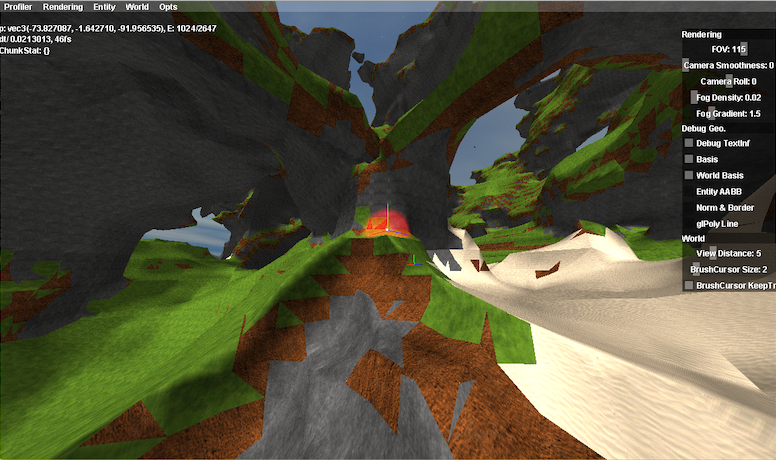

# Ethertia

An "[OtherLife](https://en.wikipedia.org/wiki/OtherLife)" Game/Program, wanted:  
MinecraftFreedom + GTAVDetail + VRChatInteraction

> Site: https://elytra.dev/ethertia  
> Source: https://github.com/Dreamtowards/Ethertia `src/ethertia/client/Ethertia.h`    
> devs: Eldrine Le Prismarine (https://elytra.dev/~pris), Dreamtowards

Demo screenshots: (Early test, 20221005)

Demo videos:
[2 MarchingCubes 202208],
[1 Blocky 202205].

## Development

---

[comment]: <> (*_todolist*)

### Generation I
- [x] Blocky Terrain, Unified Grids [@2022_Jul](https://www.youtube.com/watch?v=xDwgZkYrPm8&t=14s)
- [x] Cubical Chunks

 

- [x] Raycast traverse (unified grid voxel.) [@2022_Aug Raycast, Color](https://www.youtube.com/watch?v=nmRsTBDnoLQ)
- [x] OBJ Model Load. [@2022_Aug OBJLoader](https://www.youtube.com/watch?v=MbTZ_UI1tBo)  
- [x] Simple Trees. (Log, SpreadLeaves.)
- [x] Vines, Tallgrass (Flowers, Shrubs, Ferns) [@2022_Aug Vines](https://www.youtube.com/watch?v=0Ut6vLzkgA8)
- [x] GuiSlider, GuiCheckBox, GuiTextBox [Bili @2022_Aug23](https://www.bilibili.com/video/BV1yU4y1k7EU)
- [x] Frustum Culling

### Generation II
- [x] Smooth Terrain (MarchingCubes) 
- [ ] Smooth Terrain (SurfaceNets)
- [ ] Octrees (SVOs, Varying Grids)
- [ ] LoD (for SurfaceNets & SVOs)

 

- [x] Naive Triplanar UV Mapping.
- [x] Simple Sphere Brush [Bili @2022_Aug30](https://www.bilibili.com/video/BV1JB4y1G7np)
- [x] BulletPhys integrate.
- [ ] World Storage
- [ ] SDFs Brushes.
- [ ] Brush Masks (Limit, Exclude)
- [ ] GuiScrollBox

 

- [ ] Particles
- [ ] Deferred Rendering
- [ ] Grass Batch Rendering
- [ ] Simple Clouds (Flat noise)
- [ ] Blocky Clouds (Multi layers)
- [ ] Acid Rendering (Inception)
- [ ] Biomes
- [ ] Crafting Table [?]
- [ ] Cars. (wheels and body)
- [ ] Environment Reflection.
- [ ] Paradox Mapping.
- [ ] Shadow Mapping (necessary?)
- [ ] SSAO.

### Generation III
- [ ] LoD (for Dual Contouring & SVOs)
- [ ] Octrees.
- [ ] Unified Theory of Smoothness & Sharpness features.

 

- [ ] VR Supports. MotionTrack. IKs.
- [ ] Skeletal Animation. Frame transfer.

[comment]: <> (CLion-2020.3.4)

---

一种自由直觉的方法 构建精细体积模型

一直以来，多边形网格 (polygons, triangle meshes) 占据几何表示方法的主要地位，无论影视场景 建筑设计 游戏环境。
其简要统一的结构, 具很强的通用性 底层性 灵活开放性。

然而，Minecraft 的出现，让一些人开始考虑。  
现在需要一种 自由 直觉的方法，可以动态修改场景。最好以精细的程度，允许大规模地形，直觉简单的操作。

- Teardown 密集单颗像素
- RisingWorld UnifiedGrids MarchingCubes.
