[comment]: <> (# Ethertia <small style="opacity: 80%">以太效應 <sup><a href="https://elytra.dev/ethertia">[Site]</a><a href="https://github.com/Dreamtowards/Ethertia">[Src]</a><a href="https://elytra.dev/~pris">[Dev]</a></sup></small>)

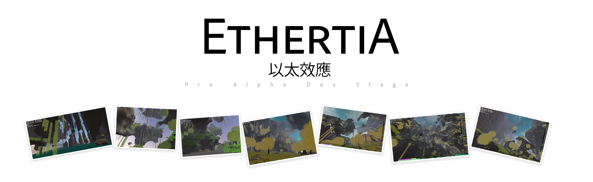

[](https://github.com/Dreamtowards/Ethertia/actions/workflows/macos.yml)
[](https://github.com/Dreamtowards/Ethertia/actions/workflows/windows.yml)
[](https://github.com/Dreamtowards/Ethertia/actions/workflows/linux.yml)
[](https://discord.gg/2gzHbuXF)
<a href="https://jq.qq.com/?_wv=1027&k=tgM29oDM" style="background: #444; color: #fff; padding: 4px 6px; border-radius: 3px; font-size: 11px; vertical-align: top;">QQ群组</a>
<a style="background: #f44; color: #fff; padding: 4px 6px; border-radius: 3px; font-size: 11px; vertical-align: top;">All rights reserved</a>

[comment]: <> ([![Linux]&#40;https://github.com/raysan5/raylib/workflows/Linux/badge.svg&#41;]&#40;https://github.com/raysan5/raylib/actions?query=workflow%3ALinux&#41;)


Ethertia. Building World while Interacting People / 建造 互动 生存 探索  


[comment]: <> (目标:)
[comment]: <> (和挚友一起互动玩耍，坐火车，去剧场听DJ或看演出。建造喜欢的地方，学校，或幻想之地。)
[comment]: <> (去领略大自然风光 深奥地形生成。)

---

预览视频:

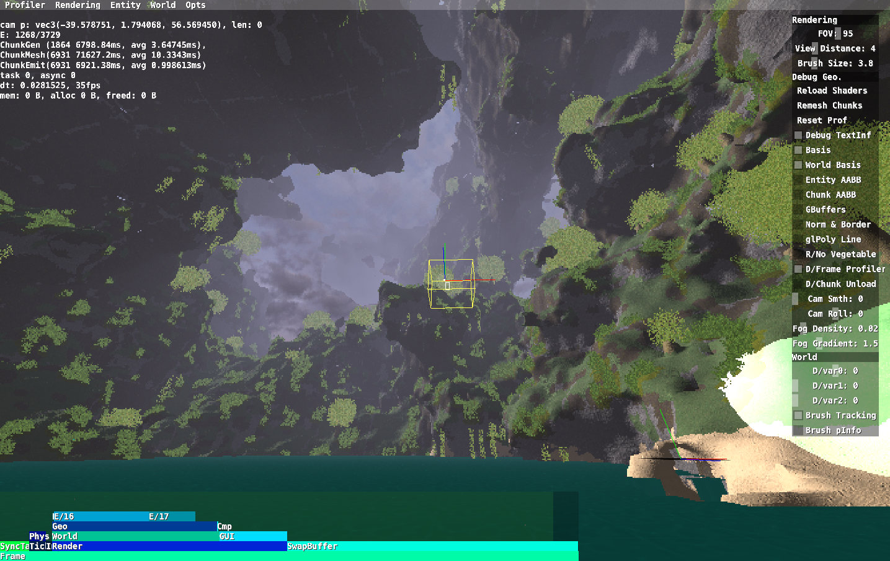

[comment]: <> (![]&#40;run/screenshots/2022-12-29_10.34.08_418.762.png&#41;)

[comment]: <> (Minecraft<sup>Freedom</sup> + GTAV<sup>Detail</sup> + VRChat<sup>Interaction</sup>)

已完成:
- [x] Surface Nets (Unified Grids) (基本平滑体素模型构建 Isosurface 对偶型等值面提取演算法)
- [x] Multi-Material Terrain, 多材质地形 高度图边缘过渡，纹理映射
- [x] Deferred Rendering 延迟渲染, Cubic Chunk 方形区块
- [x] UDP 快速网络通信(optical reliable) 数据包 处理系统

### All Versions / Plan

- Ethertia Beta 0.0.1
  - [ ] World Storage
  - [ ] Biomes, blend
  - [ ] Dropped Items (Entity)
  - [ ] Item System
  - [ ] Player Inventory, equipments
  - [ ] Player Health
  - [ ] Crops, Carrots, Potatoes

<br>

- Ethertia Beta 0.0.2
  - [ ] SSAO
  - [ ] Particle System
  - [ ] Reflection Mapping, in materials, Screen space.
  - dynamic water waves. refract. view angle.
  - Flat Atmosphere
  - Light Shaft
  - Chunk Culling
  - Decals at Terrain digging
  - Volume Fog

<br>

- Ethertia Beta 0.0.3
  - [ ] Fireockets, 
  - [ ] Hook Rope
  - [ ] Rope (Lead)

<br>

- Ethertia Beta 0.0.4 
  - [ ] Transformation Move Controller

<br>

- Ethertia Beta 0.0.5
  - LoD Terrain
  - CSG Advanced Modeling System.
  - WorldGen.

<br>

- Ethertia Beta 0.1.2
  - Animals. Skeleton Animation & Physics.
    - Pig, Sheep, Chicken, Cow
    - Horse, Donkey, Mule

<br>

- Ethertia Beta 0.2.0
  - Multiplayer
    
---

- Ethertia 1.0.3
  - Theatrical
    - Screen cast
    - Audio
    - SpotLight
    - Camera
    
- Ethertia 1.0.5
  - Vehicles
    - Train
    - Car
    - Subway
    - Truck
    - Hawkins Wheelchair
  
- Ethertia 1.1.0
  - Character, Avatar. Cel Shading

- Ethertia 1.2.0
  - Mod (Native / Script / Distro)
  - VR, MotionTrack
    
- Ethertia 1.3.0 


开发安排:
  - 2022-12-23&24
    - Networking UDP, Packet Trans & Process.
  - 2022-12-27
    - blender 建筑建模草案
  - 2022-12-29
    - screenshot 去除alpha分量 同时优化速度
    - Mtl in UV，将MtlId数值融入UV.x，UV.y数值特征则显示其是否是 pure mtl
    - +Ethertia::getCursor().hitEntity 
    - /tp @t @s 表达式
    - /mesh new mdl.obj, /mesh diff tex.png
  - 2022-12-30
    - Ethertia::notifyMessage()
    - GuiMessageList 常显，定时消失。
    - Character Capsule
  - 2022-12-31
    - 决定是否用 btKinematicCharacterController 还是自己实现相关控制器. 放弃 里面太复杂 而且已被官方弃用
    - 关闭 T_ChunkVegetable 网格的碰撞 (但是raycast要有), 用 CollisionFilter Group&Mask 的方法. EntityMesh::m_NoCollision
    - EntityPlayer onGround 判定, Capsule 方法
    - 新方法取消 Spectator Gamemode 的碰撞。不替换CollisionShape，而是用 CollisionFlags
    - EntityPlayer movement basics. 飞行加速 降落时移动减速 在地上时高跳跃
    - [x] 修复bug bulletphys 一旦无速且脚下没东西 就把我锁死 不会自由落体 除非施加强力 - 已修复于230101
  - 2023-01-01
    - 血量条 物品栏示意渲染
    - GuiScreenChat, 打开确定性 不会重复"/"
      - 上翻 下翻 / 最后编辑
      - [ ] TabComplete 立刻放弃了 需要比较多工作量 命令都要提供Completes 不必现在做
    - 掉落伤害 力的冲撞 根据 btContactPoint::getAppliedImpulse() 但是很不直觉，3米掉落就能达到 40米跌落的冲击力的一半
      - 新的碰撞结果检测方法 主动检测而不是Callback 新的onGround判定方法 更统一简单
      - [ ] 更直觉的摔落伤害
    - /entity new/mesh/diff/delete 系列命令添加。删去/mesh命令 由于它的缺少通用性
      (因为我想添加plane或hull，莫非还要再加新的类似命令? no, 还是用一个统一命令好了)
    - World.cpp 分离出来了，World.h 现在可被包含进 Entity.h, Chunk.h
    - 找到更改地形后玩家卡在空中的原因/解决方法了。因为碰撞点缓存还在。
      不能直接setCollisionShape，要removeRigidBody后更改再add [refresh collision](https://pybullet.org/Bullet/phpBB3/viewtopic.php?t=9216)
    - 尝试VelocityDiff 判定摔落伤害，也不直觉 随便也容易产生伤害
    - 取消了 EntityMesh::m_NoCollision via CollisionFilter/Group/Mask 的方法，而是和观察者一样 用 CollisionFlags CF_NO_CONTACT_RESPONSE 了
    - [x] 发现bug 打开界面 关闭后 轻微移动鼠标 就会有巨大delta 视野"随机"变成了另一个视野 困扰了1.5小时 很无语。已修复于230102
  - 2023-01-02    
    - bugfix Extreme Mouse DX caused by glfwSetInputMode. 由于禁用启用鼠标时 内部会设置鼠标位置，因此我们的
      MousePos callback会产生巨大DX，造成视野瞬移等问题。解决方法 忽略启用/禁用鼠标后的下一个DX (鼠标位置要更新 只不过不计入DX)
    - Snapshot Release r230101p. 
      - Windows GNU dll(s) 补齐
    - 修复FastSIMD 默认CPU最高等级不适应设备的问题，可自定义等级
    - 配置 自定义MtlTexResolution
  - 2023-01-03
    - Ethertia Site init. Header, KeyFeatures.
  - 2023-01-04
    - Commands::intiCommands(). Extract Cmd Impls. registry.
    - All Versions plain init.
    - World Load/Unload
    - PerlinNoiseGen copy Deprecated.
    - SurfaceNets 构建加速，缓存FPs (avg 5.5ms -> 3.5ms)
    - OpenAL Soft. init. Device, Context, Capture
  - 2023-01-05
    - OGG Load, stb_vorbis.
    - AudioSource, AudioBuffer wrap.
    - Build OpenAL for Windows.
  - 2023-01-09
    - ChunkGenProc, ChunkMeshProc 分成两个线程 分别生成区块/处理网格
    - Scheduler 上锁, 修复了相关的执行错误

    - ARM 贴图，组合Disp/Rough/AO/Metal. DRAM Synthetic Atlas
    - World Storage 世界存储。  
    - GUI 主界面
    - Vine 藤蔓材质
      - 如果放入Atlas就浪费了其他Norm Disp的空间了。
        没事先这样，等到时候浪费太多了，就再用新的渲染器 单独渲染这些植物
    - OpenAL Damage Sound
    - Items
      - Pickaxe
      - Materials 
      - Inventory

[comment]: <> (特殊功能)
[comment]: <> (- 和OBS/直播媒体流对接 让视频/音频流 连接到我们的国家顶级剧院和顶级环绕巨型音响, )
[comment]: <> (  以便看电影, 举办发布会, 大型DJ音乐节。也可以请乐器专家连接MIDI或初音未来的作曲 举办海边音乐会)
[comment]: <> (想做的事：)
[comment]: <> (- 建个巨型雕像 就像巴西山峰之巅/2b2t的那个 Cristo Redentor 雕像。温暖壮阔古典辉煌。)
[comment]: <> (- 世界树之城。巨型的世界树 底下是古典小城市。藤蔓垂下 晚上树上发光。)
[comment]: <> (- 海边音乐会。光锥大型灯光。国家顶级剧场 观影 看发布会 DJ。)
[comment]: <> (- 建造我喜欢的学校。场所。)
[comment]: <> (- 探索自然景观 海边峭壁 巨树密集 高耸奇幻悬崖)


<br>

### Credits

__Ethertia is developed by:__  
Game design, programming, graphics: [Eldrine Le Prismarine](https://elytra.dev/~pris)  
Music and sounds:  
Ingame artwork:   
Used libs&tools: cpp, glfw, glm, stb, bulletphys

### Build

- Working directory: `./run`
- Build shared-library and the program.   
  `cmake -DCMAKE_BUILD_TYPE=Release -G "CodeBlocks - Unix Makefiles" -DBUILD_SHARED_LIBS=1`  
  Will compile to: e.g. `./run/bin/macos-x86-64`


### Commands

```
/gamemode <1/2/3>   # Survival, Creative, Spectator
/fly [on/off]
/tp <target> <dest>
/tp <x y z>
/tp <target> <x y z>

/connect <ip> <port>

/entity new mesh [obj_file]
/entity diff <tex_file>
/entity mesh <obj_file>
/entity delete             # delete cursor target entity.
```

<!--
### Quick Launch

如果你想尝试本程序而不需开发环境，那将很简单。

1. 在Releases中，下载适合你的系统的已编译的程序，例 `Ethertia.exe` (约10MB. DedicatedServer.exe 是服务端 可不管)

   
2. 下载"运行时/资源文件" `run.zip` (上百MB，含程序库~4MB, 及资源文件)
   

3. 解压 `run.zip`, 把第一步的 `Ethertia.exe` 放在例 `./run/bin/windows-amd64` 里 (根据你的系统)


4. 回到 `./run` 目录, 执行例 `./run/bin/windows-amd64/Ethertia.exe`  

> (因为./run是工作目录 所以在这里执行程序, 而程序可以放别处/和动态连接库放一起)


需要做:  
- [ ] ___Rendering___
  - [ ] Reflection Mapping, Screen Space. 反射渲染 水面反射 或材质反射 (冰/汽车表面)
  - [ ] 水面动态波纹, 斜视透度, 折射.
  - [ ] SSAO. 环境光遮蔽 提高层次感
  - [ ] Flat Atmosphere. 平面大气层渲染 基于半物理的天空散射&雾气
  - [ ] Light Shaft. 光锥
  - [ ] 地形挖掘 贴花
  - [ ] 一些特殊效果 盗梦空间的世界卷曲 虚拟实惊的万花筒扭曲 刺客信条的点阵世界表面 极光
  - [ ] Chunk Cave Culling 区块渲染剔除 [BSD](https://tomcc.github.io/2014/08/31/visibility-2.html)

- [ ] ___World & Terrain___
  - [ ] WorldGen, Biomes. 地形生成 生物群系, 这是无底洞
  - [ ] Voxel LoD 地形远处低细节等级，远景加载
  - [ ] CSG, Advanced Modeling System. 更专业的建筑系统 实时构建更准确的建筑模型
    
- [ ] ___Entity & Funcs___
  - [ ] 农作物种植 马铃薯 胡萝卜
  - [ ] Vehicles 汽车 火车 地铁 船 直升机 霍金轮椅
  - [ ] Theatrical. Screen Cast, Light,. 剧场设备 屏幕投射 光轴 音响 摄影机
  - [ ] 动物 猪牛羊 鸡 马驴螺
  - [ ] Item, Inventory, ItemStack. 物品系统
  - [ ] 玩家血量 装备. 行走碰撞.
  - [ ] Spline Entity, Transformation Move Controller
  - [ ] 强力缰绳, 烟火
  - [ ] 掉落物
  - [ ] Mod 系统
    - Distro 其他人的修改版
    - Native C/Cpp Mod, 强大 强行修改 但是繁琐 平台依赖 权限过大应该验证
    - Script Mod, 可控安全 相对简单

- [ ] ___Multiplayer & Interactive___
  - [ ] Multiplayer 多人游戏系统
  - [ ] Skeleton Animation etc 骨骼动画 实时网络传输 穿戴定位器动作跟踪
  - [ ] Cel Shading, Character. 人物渲染


## Updates


### 22u49 @20221205 [.43]

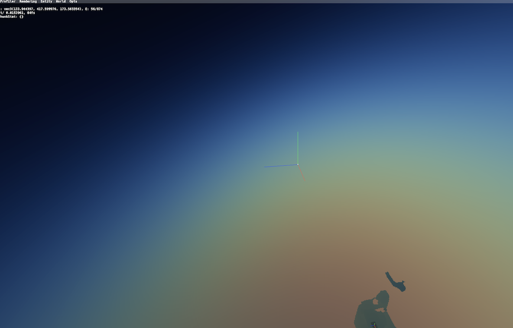
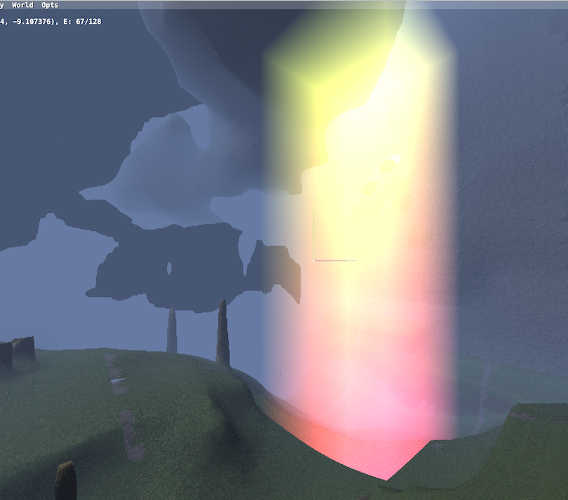
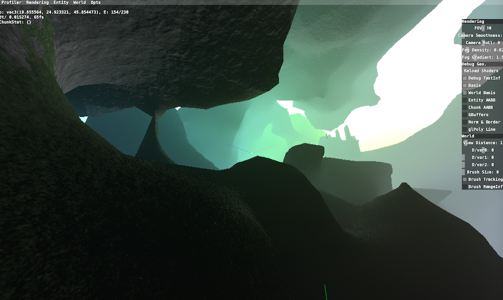

- [ ] Atmosphere test.
- [ ] Fix NormAvg at Chunk Boundary, fail. cost lot, have bugs yet.
- [x] GuiScrollBox, Gui::gPushScissor()
- [x] misc: OBJLoader::saveOBJ(), Deferred Render Composer FBO. Mth::worldRay()

### 22u48 @20221129 [.68]

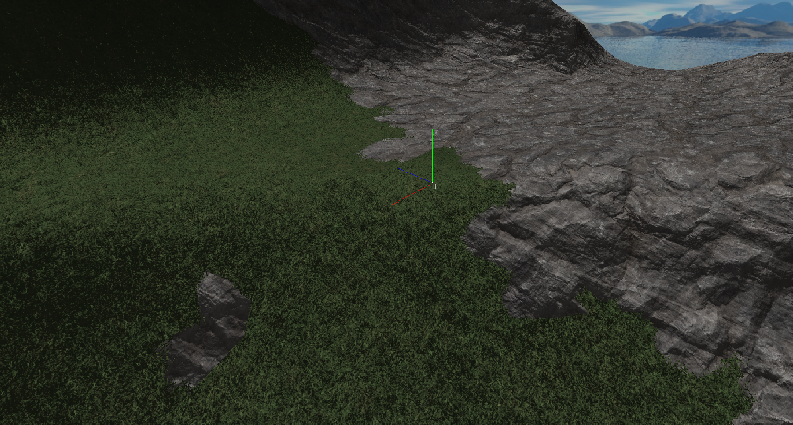
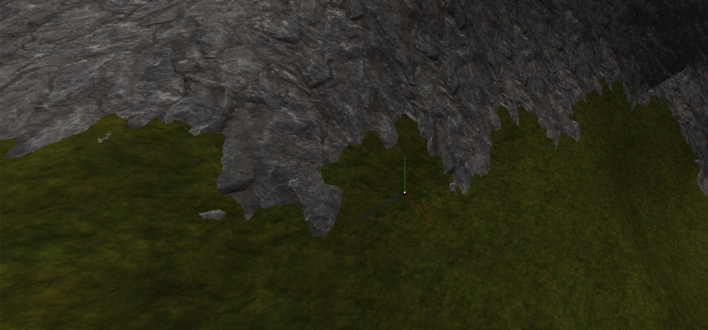
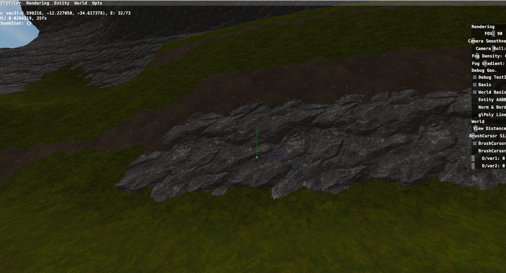
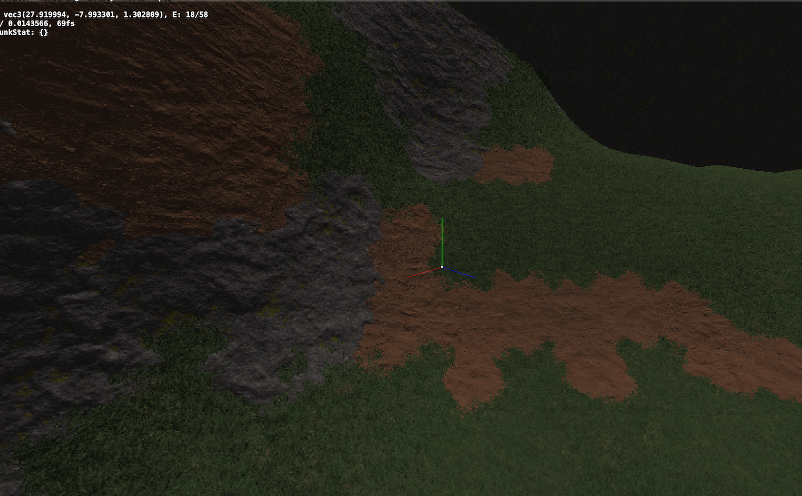
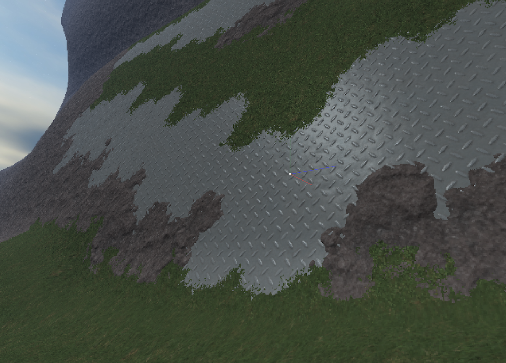

- [x] [.79] SurfaceNets Terrain, Unified Grids
  - FeaturePoint Evaluation, Naive Method.
  - 1 of 8 Voxel Material Determine. Distance Method.
- [x] [.71] Terrain Material Texturing with Triangle Blend & Height Map
- [x] [.63] Triplanar Normal Mapping.
- [x] [.54] Material Texture Atlas spec.
- [x] [.42] Framebuffer, gbuffer init.

- [x] [.63] Deferred Rendering
- [x] [.34] Specular Lighting via Roughness map.

### 22u41 @20221014 [.29]

- [x] [.42] PerFragment Material Texturing (single material out of greatest weight in the triangle.)

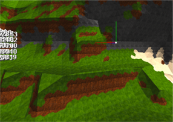  

### 22u40 @20201006

  
_ps. marching cubes with kernel program generated vertex UVs._

- [x] [.62] Multiple Material Texturing (naive full-triangle material texturing).  
- [x] [.13] Gamemode creative/spectator (collision disabled, `/m_Gamemode <1/2/3>`), Fly mode (gravity disable).


---

-->

<!--


## Roadmap


### Gameplay

Create, Explore, Survive.

- **Explore**
  - Biomes: Deserts, Plain, Cliff

- **Farming**
  - Vegetables: Wheat, Potatoes, Carrots

- **Vehicles**
  - Cars
  - Trains
  - Boats

### Todos

<br>


- [ ] SVOs and LoD for SurfaceNets
- [ ] SDF Brushes, Brush Masks (Limit, Exclude)
- [ ] Biomes

- [ ] Particle system
- [ ] Batch Grass Rendering
- [ ] Simple Clouds (Flat noise), Blocky Clouds (Multi layers), Volume Clouds
- [ ] Acid Rendering (Inception)
- [ ] Environment Reflection.
- [ ] Paradox Mapping.
- [ ] Shadow Mapping (necessary?)
- [ ] SSAO.

- [ ] World Storage
- [ ] Networking, Multiplayer

- [ ] Crafting Table [?]
- [ ] Cars. (wheels and body)
- [ ] Dual Contouring & SVOs & LoD
- [ ] Unified Theory of Smoothness & Sharpness features.
- [ ] VR Supports. MotionTrack. IKs.
- [ ] Skeletal Animation. Frame transfer.


### Ancient

- [x] Blocky Terrain, Cubical Chunks, Unified Grids, Basic Population. Simple Trees, Plants [@2022_Jul](https://www.youtube.com/watch?v=xDwgZkYrPm8&t=14s)
- [x] GUI System. GuiSlider, GuiCheckBox, GuiTextBox, GuiScrollBox.. [Bili @2022_Aug23](https://www.bilibili.com/video/BV1yU4y1k7EU)
- [x] MarchingCubes Terrain, Bulletphysics integrate. Simple Brush. Triplanar UV Mapping & Multi-Material. [Bili @2022_Aug30](https://www.bilibili.com/video/BV1JB4y1G7np)


### 


[Tutorial, Discussion, Questions; Multiplayer, Mods, Redstone]
Topic (Mods, Survival, Dev) / Type (Tutorial, Discussions, Questions)


Forum
- _Comprehensive Discussion_
  - Official News
  - Gameplay Discussions
  - Development Discussions
    - Software & Tools
  - Conferences
- Maps
- Mods
  - Resourcepacks
  - Shaderpacks
- Servers
- Avatars
- Modpacks


1. Normal Smooth at ChunkBoundary
1. Water
1. Cloud


**Building**

**Terrain Generation**

**Rendering**

**Multiplayer**

**GUI**

**Modding**

**Interacting**

-->