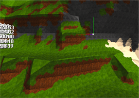
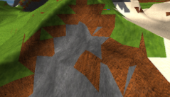

# Ethertia

An "[OtherLife](https://en.wikipedia.org/wiki/OtherLife)" Game/Software/Program, wanted:  
MinecraftFreedom + GTAVDetail + VRChatInteraction

> Site: https://elytra.dev/ethertia  
> Source: https://github.com/Dreamtowards/Ethertia <!--`src/ethertia/client/Ethertia.h`-->    
> Devs: [Eldrine Le Prismarine](https://elytra.dev/~pris), Dreamtowards

Demo videos:
[20221008](),  
Demo screenshots: (Early test, 20221005)

## Roadmap

**Building**

**Terrain Generation**

**Rendering**

**Multiplayer**

**GUI**

**Modding**

**Interacting**

### Gameplay

Create, Explore, Survive.

- **Explore**
  - Biomes: Deserts, Plain, Cliff
  
- **Farming**
  - Vegetables: Wheat, Potatoes, Carrots
  
- **Vehicles**
  - Cars
  - Trains
  - Boats

### Credits

__Ethertia is developed by:__  
Game design, programming, graphics: [Eldrine Le Prismarine]()  
Music and sounds:  
Ingame artwork: 

__Ethertia uses following libraries&tools:__  
- Cplusplus, GCC, CLion IDE, CMake
- GLFW, GLM, glad, opengl
- stb_image, stb_vorbis by [Sean Barrett ('nothings')](http://nothings.org)
- BulletPhysics by Erwin Coumans

## Updates

### Todos

 

22u42 / Oct 22, 2022

- [ ] SurfaceNets Terrain, Unified Grids

22u43 / Oct 29, 2022

- [ ] SVOs and LoD for SurfaceNets
- [ ] SDF Brushes, Brush Masks (Limit, Exclude)
- [ ] Biomes

22u44 / Nov 5, 2022

- [ ] Deferred Rendering
- [ ] Particle system
- [ ] Batch Grass Rendering
- [ ] Simple Clouds (Flat noise), Blocky Clouds (Multi layers), Volume Clouds
- [ ] Acid Rendering (Inception)
- [ ] Environment Reflection.
- [ ] Paradox Mapping.
- [ ] Shadow Mapping (necessary?)
- [ ] SSAO.

22u45 / Nov12, 2022

- [ ] World Storage
- [ ] Networking, Multiplayer

22u46 / Nov 19, 2022

- [ ] Crafting Table [?]
- [ ] Cars. (wheels and body)
- [ ] Dual Contouring & SVOs & LoD
- [ ] Unified Theory of Smoothness & Sharpness features.
- [ ] VR Supports. MotionTrack. IKs.
- [ ] Skeletal Animation. Frame transfer.

### 22u41 @20221014

- [x] [.42] Per-Fragment Material Texturing (single material out of greatest weight)

>   
> Fugure: Per-Fragment Material Texturing, (one single material out for the vertex with the greatest weight on the triangle.
> use a geometry shader _chunk.gsh_ to generate _TriMtlWeights, TriMtlIds_)    
> the "boundary waves" may caused by non-geo-accurate weights (i.e. not associate with volume data). However I can't wait to try
> SurfaceNets now, that would fix this problem by the way.

### 22u40 @20201006

- [x] [.62] Multiple Material Texturing (naive full-triangle material texturing).  
- [x] [.13] Gamemode creative/spectator (no collision), Flying mode (no gravity).

>   
> Multiple Material Naive Full-Triangle Texturing.  
> `/gamemode <1/2/3>   # survival/creative/spectator`  
> `/fly [on/off]`

### Ancient

- [x] Blocky Terrain, Cubical Chunks, Unified Grids, Basic Population. Simple Trees, Plants [@2022_Jul](https://www.youtube.com/watch?v=xDwgZkYrPm8&t=14s)
- [x] GUI System. GuiSlider, GuiCheckBox, GuiTextBox, GuiScrollBox.. [Bili @2022_Aug23](https://www.bilibili.com/video/BV1yU4y1k7EU)
- [x] MarchingCubes Terrain, Bulletphysics integrate. Simple Brush. Triplanar UV Mapping & Multi-Material. [Bili @2022_Aug30](https://www.bilibili.com/video/BV1JB4y1G7np)

### 

[Tutorial, Discussion, Questions; Multiplayer, Mods, Redstone]
Topic (Mods, Survival, Dev) / Type (Tutorial, Discussions, Questions)

Forum
- _Comprehensive Discussion_
  - Official News
  - Gameplay Discussions
  - Development Discussions
    - Software & Tools
  - Conferences
- Maps
- Mods
  - Resourcepacks
  - Shaderpacks
- Servers
- Avatars
- Modpacks