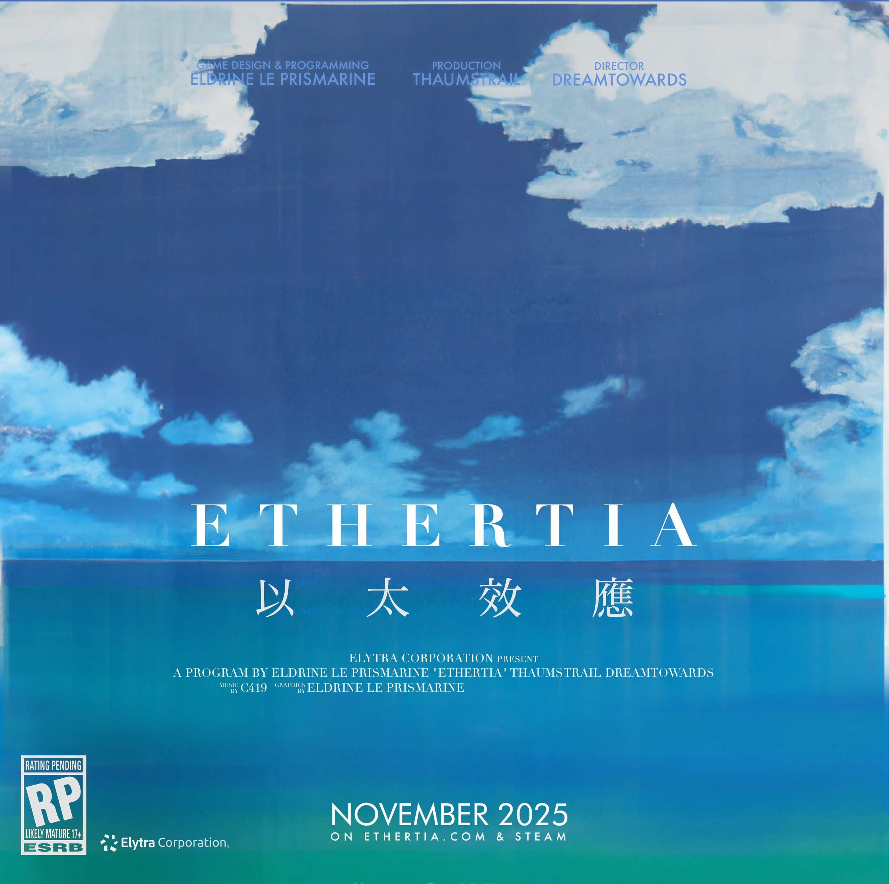

[comment]: <> (# Ethertia <small style="opacity: 80%">以太效應 <sup><a href="https://elytra.dev/ethertia">[Site]</a><a href="https://github.com/Dreamtowards/Ethertia">[Src]</a><a href="https://elytra.dev/~pris">[Dev]</a></sup></small>)



[](https://github.com/Dreamtowards/Ethertia/actions/workflows/macos.yml)
[](https://github.com/Dreamtowards/Ethertia/actions/workflows/windows.yml)

[comment]: <> (<a href="https://ethertia.com" style="background: #444; color: #fff; padding: 4px 6px; border-radius: 3px; font-size: 11px; vertical-align: top;">官方站点</a>)
[comment]: <> (<a href="https://space.bilibili.com/19483166" style="background: #444; color: #fff; padding: 4px 6px; border-radius: 3px; font-size: 11px; vertical-align: top;">bilibili</a>)
[comment]: <> (<a href="https://jq.qq.com/?_wv=1027&k=tgM29oDM" style="background: #444; color: #fff; padding: 4px 6px; border-radius: 3px; font-size: 11px; vertical-align: top;">QQ群组</a>)
[comment]: <> (<a style="background: #f44; color: #fff; padding: 4px 6px; border-radius: 3px; font-size: 11px; vertical-align: top;">&#40;C&#41; Ethertia, Elytra Corporation All rights reserved</a>)

[官网](https://ethertia.com)
[bilibili](https://space.bilibili.com/19483166)
[QQ群组](https://jq.qq.com/?_wv=1027&k=tgM29oDM)
[开发安排](https://github.com/users/Dreamtowards/projects/2) | 
[(C) Elytra Corporation most rights reserved](https://elytra.dev)

[comment]: <> ([![Linux]&#40;https://github.com/raysan5/raylib/workflows/Linux/badge.svg&#41;]&#40;https://github.com/raysan5/raylib/actions?query=workflow%3ALinux&#41;)
[comment]: <> ([![Build-Ubuntu]&#40;https://github.com/Dreamtowards/Ethertia/actions/workflows/linux.yml/badge.svg&#41;]&#40;https://github.com/Dreamtowards/Ethertia/actions/workflows/linux.yml&#41;)


[comment]: <> ([![Discord]&#40;https://img.shields.io/discord/870689606570508319?logo=discord&#41;]&#40;https://discord.gg/2gzHbuXF&#41;)
[comment]: <> (目标:)
[comment]: <> (和挚友一起互动玩耍，坐火车，去剧场听DJ或看演出。建造喜欢的地方，学校，或幻想之地。)
[comment]: <> (去领略大自然风光 深奥地形生成。)

---

Building · Survive · Interact | 建造 · 生存 · 交互


[comment]: <> (预览视频:)

[comment]: <> (![]&#40;run/screenshots/2023-01-16_01.04.07_473.938.png&#41;)


[comment]: <> (![]&#40;run/screenshots/2023-01-17_17.24.46_751.785.png&#41;)

[comment]: <> (![]&#40;run/screenshots/2022-12-30_21.59.00_526.642.png&#41;)
[comment]: <> (![]&#40;run/screenshots/2022-12-29_10.34.08_418.762.png&#41;)
[comment]: <> (Minecraft<sup>Freedom</sup> + GTAV<sup>Detail</sup> + VRChat<sup>Interaction</sup>)


[comment]: <> (Ethertia 的3个主题更新: 建筑 生存 交互，分别预计在 4个月+3个月+3个月初步完成。)

[comment]: <> (- 建筑)
[comment]: <> (  - [x] 平滑体素 &#40;纯材质&#41; | Smooth Voxel Terrain &#40;Pure MTL&#41;)
[comment]: <> (    - 材质: 石头 草地 泥土 沙子 岩石 石砖 )
[comment]: <> (  - [ ] 自定模型体素 &#40;方块, 树叶 / 椅子&#41; | Custom Mesh Voxel )
[comment]: <> (    - 树叶 高草 椅子 / 衣架)
[comment]: <> (  - [ ] 离散烘培模型 &#40;旋转 位置 尺寸&#41; &#40;纯材质/自定纹理&#41; | Offgrid Baked Mesh)
[comment]: <> (  - [ ] Spline 规则生成模型: 铁轨 围栏 )
[comment]: <> (- 生存)
[comment]: <> (  - [ ] 耕种)
[comment]: <> (    - 农作物: 胡萝卜 马铃薯 小麦 / 水稻 番茄 玉米 葡萄)
[comment]: <> (  - [ ] 生物)
[comment]: <> (    - 动物: 猪 牛 羊 鸡 / 马 驴 骡 骆驼 / 猫 狼 兔)
[comment]: <> (  - [ ] 挖矿)
[comment]: <> (    - 矿物: 铁, 煤, )
[comment]: <> (  - [ ] 探索&收集)
[comment]: <> (    - [ ] 生物群系: 平原 沙漠 冻原 热带雨林 森林)
[comment]: <> (    - [ ] 遗迹: 村庄 地牢 矿脉)
[comment]: <> (  - [ ] 建筑)
[comment]: <> (  - [ ] Boss)
[comment]: <> (- 交互)
    

[comment]: <> (以上为*游戏性列表*，接下来为*功能性列表*:)


[Ethertia Dev Schedule / 开发安排](https://github.com/users/Dreamtowards/projects/2)


### Versions & Plan <small>(deprecated on 230206)</small>:

- Ethertia Alpha 0.1.0 :: Building & Creative Mode (建筑系统)  
  est. -2023.02.28

- Ethertia Alpha 0.2.0 Gameplay & Survival Mode (游戏性)  
  est. -2023.4.30. Framing, Mining, Melting & Crafting, Animals, Vehicle, Brewing

- Ethertia Alpha 0.3.0 :: Graphics (渲染)

- Ethertia Alpha 0.4.0 :: WorldGen (地形生成)  
  Biomes, Structures, Caves & Ores

- Ethertia Beta 0.5.0 :: VR, Avatar & MotionTrack (自定人物&动作跟踪, VR.)

- Ethertia Beta 0.7.0 :: Multiplayer (多人)  
  多人系统会增加很多复杂性 导致开发进度缓慢 所以放在后期. 以免前期样子还没出来就破产了

- Ethertia Beta 0.8.0 :: Mod (模组支持)  
  Theatrical, TwilightForest

- Ethertia 1.0.0 Building, Survive, Interact. 建筑 生存 交互

---


### Developers & Credits 
_(order by join time)_


- **Eldrine Le Prismarine** (Voxel, Graphics, Gameplay)
  
- **Thaumstrial** (Creative Director 策划)  
  _230131_ basic vehicle relationships. _230201_ helicopter control init.
  
<br>

暂非核心成员贡献 后续将放在官网首页底部

- [**Kmroiosn**](https://github.com/Kmroiosn)   
  _230209_ ModLoader/ dll program load for Windows.


<br>

> - Program 程序
> - Game Design 策划
> - Music Creator 作曲
> - Art Creator 艺术 (Concept Art, Modeling, Ingame Artwork..)


## Build:

#### Windows:
1. use **gcc** compiler & **ucrt** standard library (Universal C Runtime). (Not MSVC)  
   you could download them in https://winlibs.com, ([mingw64ucrt-10.0.0-gcc-12.2.0-x86_64(.zip)](https://github.com/brechtsanders/winlibs_mingw/releases/download/12.2.0-15.0.7-10.0.0-ucrt-r4/winlibs-x86_64-posix-seh-gcc-12.2.0-llvm-15.0.7-mingw-w64ucrt-10.0.0-r4.zip))

2. compile it use e.g. `cmake -DCMAKE_BUILD_TYPE=Release -G "CodeBlocks - MinGW Makefiles"`   
    - if you are using IDE like CLion, setup your UCRT-MinGW, and just "Build/Run".

- if crashed on SIMD Level checking, just downgrade your simd_level in settings.json.
- make sure you have (dynamic linked) "libgcc_s_seh-1.dll", "libstdc++-6.dll", "libwinpthread-1.dll". which is part of ucrt library.

#### Darwin (OSX, Mac):
1. use **clang** compiler.

`-G "CodeBlocks - Unix Makefiles"`


<br><br><br><br><br><br><br>
<br><br><br><br><br><br><br>
<br><br><br><br><br><br><br>
<br><br><br><br><br><br><br>


---
Detail:

- Ethertia Alpha 0.1.0 Building 建筑系统  
  *est. 2023.02.28 | 建筑与生存 是Ethertia的核心 而前者是核心特点*
  - [ ] Voxel
    - [x] Surface Nets (Unified Grids) (基本平滑体素对偶型模型构建)
    - [x] Multi-Material Terrain, 多材质地形 高度图边缘过渡，纹理映射
  - [ ] Decorations
    - 装饰品/小玩意 (Bake ? Entity)
  - [ ] World
    - World Storage 世界存储
    - DayTime 日时间 / 日月交替
    - Physics Integration (bullet3)
  - [ ] Items
    - [x] 食物: Apple, Lime酸橙
    - [x] 地形材料: 石头 草地 树叶 泥土 沙子 原木
    - [ ] 合成材料: 木棒
    - [ ] 工具: 稿子 抓钩
  - [ ] Entity
      - EntityPlayer 
      - EntityDroppedItem 掉落物
  - [ ] Materials
    - [ ] 基于体素系统上 +更多模型/轮廓 + 配合不同材质
    - [ ] 农作物 Crops, Carrots, Potatoes
  - [x] GUI
      - Inventory Ops
      - HUD, Hotbar, Health, XP
  

<br>

- Ethertia Alpha 0.2.0 Graphics 渲染
  - [x] Deferred Rendering 延迟渲染, Cubic Chunk 方形区块
  - SSAO, SS Reflection Mapping, Normal Mapping 微分BTN矩阵, Bloom 辉光, Light Shaft, 光晕
  - 体积云, Atmosphere 物理大气层 穹顶深色
  - dynamic water waves. refract. view angle.
  - Chunk Culling
  - Decals at Terrain digging
  - Volume Fog
  - [ ] Fireockets, 
  - [ ] Hook Rope
  - [ ] Rope (Lead)
  - [ ] Transformation Move Controller

<br>

- Ethertia Alpha 0.3.0 Survive 生存 地形生成
  - LoD Terrain
  - CSG Advanced Modeling System.
  - WorldGen.
  - Animals. Skeleton Animation & Physics.
    - Pig, Sheep, Chicken, Cow
    - Horse, Donkey, Mule
  - [ ] 载具: 汽车 火车 单车
  - [ ] Biomes
      - [ ] Distribution
      - [ ] Boundary Blend & Mixing
  - Vehicles Train, Car, Subway, Truck, Hawkins Wheelchair


- Ethertia Beta 0.4.0 Multiplayer 多人与网络
  - [x] UDP optical reliable networking. Packet Handling

<br>

- Ethertia Beta 0.6.0 Mod 模组支持
  - 剧院Mod | Theatrical Mod (Screen cast, Audio, SpotLight, Camera)
  - 暮色森林Mod | Twilight Forest Mod
  - Mod (Native / Script / Distro)

<br>

- Ethertia Beta 0.8.0 VR, Avatar and MotionTrack
  - [ ] 多人
  - [ ] 自定义人物模型
  - [ ] VR支持
  - [ ] 动作跟踪 IK动画
  - Character, Avatar. Cel Shading
    

---


Comparers:
- Minecraft
- RisingWorld
- Valheim
- _etc._ [VoxelFarm, Upvoid] / GTA:V,SA / VRChat / World of Warcraft / Skyrim

---

Ethertia 名称起源  
(中文名 "以太效应", "以太的愿望", "以太咏叹调")  
名称由 Ether, aria 的变种组成。希望有神秘 广阔 深奥 忧郁的感觉。  
意为 通过假说中以太这种神秘广阔的介质，找到通往另一个世界的方法  
Ethertia 有些像 Ethernet. 或 Celestia.  

没有使用 Etheria 因为它太常见。

---
    

开发安排:
  - 2022-12-23&24
    - Networking UDP, Packet Trans & Process.
  - 2022-12-27
    - blender 建筑建模草案
  - 2022-12-29
    - screenshot 去除alpha分量 同时优化速度
    - Mtl in UV，将MtlId数值融入UV.x，UV.y数值特征则显示其是否是 pure mtl
    - +Ethertia::getCursor().hitEntity 
    - /tp @t @s 表达式
    - /mesh new mdl.obj, /mesh diff tex.png
  - 2022-12-30
    - Ethertia::notifyMessage()
    - GuiMessageList 常显，定时消失。
    - Character Capsule
  - 2022-12-31
    - 决定是否用 btKinematicCharacterController 还是自己实现相关控制器. 放弃 里面太复杂 而且已被官方弃用
    - 关闭 T_ChunkVegetable 网格的碰撞 (但是raycast要有), 用 CollisionFilter Group&Mask 的方法. EntityMesh::m_NoCollision
    - EntityPlayer onGround 判定, Capsule 方法
    - 新方法取消 Spectator Gamemode 的碰撞。不替换CollisionShape，而是用 CollisionFlags
    - EntityPlayer movement basics. 飞行加速 降落时移动减速 在地上时高跳跃
    - [x] 修复bug bulletphys 一旦无速且脚下没东西 就把我锁死 不会自由落体 除非施加强力 - 已修复于230101
  - 2023-01-01
    - 血量条 物品栏示意渲染
    - GuiScreenChat, 打开确定性 不会重复"/"
      - 上翻 下翻 / 最后编辑
      - [ ] TabComplete 立刻放弃了 需要比较多工作量 命令都要提供Completes 不必现在做
    - 掉落伤害 力的冲撞 根据 btContactPoint::getAppliedImpulse() 但是很不直觉，3米掉落就能达到 40米跌落的冲击力的一半
      - 新的碰撞结果检测方法 主动检测而不是Callback 新的onGround判定方法 更统一简单
      - [ ] 更直觉的摔落伤害
    - /entity new/mesh/diff/delete 系列命令添加。删去/mesh命令 由于它的缺少通用性
      (因为我想添加plane或hull，莫非还要再加新的类似命令? no, 还是用一个统一命令好了)
    - World.cpp 分离出来了，World.h 现在可被包含进 Entity.h, Chunk.h
    - 找到更改地形后玩家卡在空中的原因/解决方法了。因为碰撞点缓存还在。
      不能直接setCollisionShape，要removeRigidBody后更改再add [refresh collision](https://pybullet.org/Bullet/phpBB3/viewtopic.php?t=9216)
    - 尝试VelocityDiff 判定摔落伤害，也不直觉 随便也容易产生伤害
    - 取消了 EntityMesh::m_NoCollision via CollisionFilter/Group/Mask 的方法，而是和观察者一样 用 CollisionFlags CF_NO_CONTACT_RESPONSE 了
    - [x] 发现bug 打开界面 关闭后 轻微移动鼠标 就会有巨大delta 视野"随机"变成了另一个视野 困扰了1.5小时 很无语。已修复于230102
  - 2023-01-02    
    - bugfix Extreme Mouse DX caused by glfwSetInputMode. 由于禁用启用鼠标时 内部会设置鼠标位置，因此我们的
      MousePos callback会产生巨大DX，造成视野瞬移等问题。解决方法 忽略启用/禁用鼠标后的下一个DX (鼠标位置要更新 只不过不计入DX)
    - Snapshot Release r230101p. 
      - Windows GNU dll(s) 补齐
    - 修复FastSIMD 默认CPU最高等级不适应设备的问题，可自定义等级
    - 配置 自定义MtlTexResolution
  - 2023-01-03
    - Ethertia Site init. Header, KeyFeatures.
  - 2023-01-04
    - Commands::intiCommands(). Extract Cmd Impls. registry.
    - All Versions plain init.
    - World Load/Unload
    - PerlinNoiseGen copy Deprecated.
    - SurfaceNets 构建加速，缓存FPs (avg 5.5ms -> 3.5ms)
    - OpenAL Soft. init. Device, Context, Capture
  - 2023-01-05
    - OGG Load, stb_vorbis.
    - AudioSource, AudioBuffer wrap.
    - Build OpenAL for Windows.
  - 2023-01-09
    - ChunkGenProc, ChunkMeshProc 分成两个线程 分别生成区块/处理网格
    - Scheduler 上锁, 修复了相关的执行错误
  - 2023-01-10
    - World Storage 世界存储。
      - NBT Basic Info, InhabitedTime, Populated..
  - 2023-01-11
    - GuiScreenMainMenu init. text align y. 
    - WAV file save. from PCM 16bit 1channel. little endian system.
    - OpenAL Capture init.
  - 2023-01-12
    - // Vid WorldStore, poster
    - Profiler: +MeshGen +ChunkProc. 
  - 2023-01-13
    - FFT, Audio Frequency Spectrum basic. 音频频谱解析
    - 尝试wasm. 很impressive, 但是区别还是太大 实时程序很多结构都要改变。放弃
  - 2023-01-14
    - 地形存储视频 2497-pm1.30
    - *Biomes init.
    - bugfix: 在关闭世界时 卡机。因为线程自动关闭了 没等到他修改状态 现在在关闭前修改完成状态
    - *BiomesMapDraw 温度 湿度 分布图 (+Colors::luminance()
    - *Gui::Constraint 使用组件-功能方法添加layout，而不是flutter那种结构的 改变了策略。因为这样更原始直观 没有太多层次问题。
      - Gui::AlignConstrint, LTRBConstraint
    - GUI widgets tex init.
    - *GuiRenderer texPosSize 支持自定义 纹理位置，支持负数TexSize(反转采样) , 负数w/h 反向w/h  
      Gui::drawRect Gui::DrawRectArgs
    - HotbarSlot Hotbar 显示 & Control, GuiScreenPause 顶部
    - Gui::drawStretchCorners() 4corners / 1corners stretch
  - 2023-01-15
    - bugfix 开发环境 必须要ucrt 否则链接错误诡异
    - ReloadControl 资源重载功能 尝试
    - Gui::addPreDraw(), xywh(), grow()
    - GuiInventory 初始化
    - 经验条 血量条 初步
    - init::ItemTextures. Apple, Lime, Pickaxe found assets
  - 2023-01-16
    - *Material::REGISTRY! Material id 系统变了, 几乎没有性能损耗(除了指针空间) 但是可靠性/扩展性提升到顶 易用性也好了
    - MaterialTextureAtlas 配合无序的REGISTRY，用了sort 确定离线id
    - Item::ComponentMaterial, +stone材质物品.
    - gui darkblue slots, gui daytime
  - 2023-01-17
    - 简化+强化 Loader::loadAssets 相关操作, 使用 ref 而不是 ptr
    - DRAM Baking!!!! 将disp rough [ao, metal] 4张纹理图 烘烤到一张图里 并缓存。节省空间 加载时间 采样时间 / [x] ARM 贴图，组合Disp/Rough/AO/Metal. DRAM Synthetic Atlas
    - Material Items
    - GuiInventory HoveredItem, PickingItems
    - Grapple, ItemComponentMaterial onUse.
    - +12 Materials, +Meadow StoneBrick BrickRoof
    - ItemTextures Atlas, Bake!
    - item material view.png ps准备物品预览图
    - BlackTarget 黑色线框 瞄准
    - Hybrid BlockMode 方块
    - HitPointEntityGeo 目标点附近网格显示
    - 中键拾取 DebugTex HitCell信息
  - 2023-01-18
    - BlockyTerrainMeshGen, -mix 
    - Command::REGISTRY, onCommand, onComplete.
    - command /mesh <new/set>, /time set 2:30pm
    - SunPos 初步太阳位置光线 但还没月亮光线
    - Particle Renderer,shader 粒子渲染初步 广告牌，+Vertical
  - 2023-01-19
    - Ethertia Wiki init
    - TabCompete 第一段
    - Skyboxes, Blend
    - Skybox 3*2 Load.
    - Basic Sun/Moon shader SunPos/SunColor/FogColor
  - 2023-01-20
    - Vulkan. MoltenVK, PhysDevice, LogicalDevice
    - addDelayTask fix
  - 2023-01-21
    - Vulkan Surface, Swapchain
    - 添加一个Blocky Mesh via OBJ.
    - cash_register, short_grass, stool, tall_fern. id -> map-order, no reg-order.
    - tinyobj loader
  - 2023-01-22+
    - sky gradient.
    - *dyn particles, atlas.
    - some mtl mesh.
    - *gui worldlist, newworld.
    - think 'heap' chunk store.
  - 2023-01-29
    - *World Store. Palette. simple separate chunk files.
    - bugfix: population incorrect: 错误原因是nbt++不支持bool, 所以读到的popul总是true. 要手动int8 as bool
      bugfix: delay chunk near mesh. 仅小提升 更精确合理的延迟时间 不阻塞 近处优先
    - *GuiScreenSettings init.
    - GuiScreenPause top modify. 顶部结构修改
    - World Saving Hint 世界保存的提示 (简单
  - 2023-01-31
    - 多光源 Diffuse Specular Ambient Attenuation
    - EntityLantern
    - BUG 从32x像素纹理 upsampling到512细节纹理 默认是模糊采样 而不是nearest. 应该做一个判断 原纹理尺寸 太小就nearest 但是stb image resize好像不支持nearest?
    - +rock_mossy, rock_smooth, shurb, spruce_leaves..
    - remove grass_fp gen      
    - Material.m_IsVegetable 简化 ChunkMeshGenBlocky判断
    - EntityTorch, particles.
    - dll load. mod init call.
  - 2023-02-01
    - 分离出了 Loader.cpp
  - 2023-02-02
    - Deco CTM拼接纹理 如何只用很少的基本纹理 创建出 实体拼接- 先去学学他们怎么做的
    - helicopter move control. 
    - 面向场景的功能更新 
      
    - Workbench, Bed, Ladder
    - IronChain, Cobweb
    - Wheat Crops
    - Glass

      
    - Material / Texture / Model /meta 架构模式?
    - 受到 Cocricot的灵感: 一个轮廓+不同纹理?
    - 玩家血量 10
    - 手拿物品渲染
    - DamageSource - 就像mc的Crepper被骷髅用火箭射到tnt炸死都能追踪到伤害来源是骷弓
    - 修复bug：有些地方没有population
    - [x] GUI 主界面初步
    - Vine 藤蔓材质
      - 如果放入Atlas就浪费了其他Norm Disp的空间了。
        没事先这样，等到时候浪费太多了，就再用新的渲染器 单独渲染这些植物
    - OpenAL Damage Sound
    - [x] Items Pickaxe Materials Inventory

[comment]: <> (特殊功能)
[comment]: <> (- 和OBS/直播媒体流对接 让视频/音频流 连接到我们的国家顶级剧院和顶级环绕巨型音响, )
[comment]: <> (  以便看电影, 举办发布会, 大型DJ音乐节。也可以请乐器专家连接MIDI或初音未来的作曲 举办海边音乐会)
[comment]: <> (想做的事：)
[comment]: <> (- 建个巨型雕像 就像巴西山峰之巅/2b2t的那个 Cristo Redentor 雕像。温暖壮阔古典辉煌。)
[comment]: <> (- 世界树之城。巨型的世界树 底下是古典小城市。藤蔓垂下 晚上树上发光。)
[comment]: <> (- 海边音乐会。光锥大型灯光。国家顶级剧场 观影 看发布会 DJ。)
[comment]: <> (- 建造我喜欢的学校。场所。)
[comment]: <> (- 探索自然景观 海边峭壁 巨树密集 高耸奇幻悬崖)


<br>

### Credits

__Ethertia is developed by:__  
Game design, programming, graphics: [Eldrine Le Prismarine](https://elytra.dev/~pris)  
Music and sounds:  
Ingame artwork:   
Used libs&tools: cpp, glfw, glm, stb, bulletphys

### Build

> for Windows system, requires ucrt mingw64 "winlibs-x86_64-posix-seh-gcc-12.2.0-llvm-15.0.6-mingw-w64ucrt-10.0.0-r3.zip"

- Working directory: `./run`
- Build shared-library and the program.   
  `cmake -DCMAKE_BUILD_TYPE=Release -G "CodeBlocks - Unix Makefiles" -DBUILD_SHARED_LIBS=1`  
  Will compile to: e.g. `./run/bin/macos-x86-64`


### Commands

```
/gamemode <1/2/3>   # Survival, Creative, Spectator
/fly [on/off]
/tp <target> <dest>
/tp <x y z>
/tp <target> <x y z>

/connect <ip> <port>

/entity new mesh [obj_file]
/entity diff <tex_file>
/entity mesh <obj_file>
/entity delete             # delete cursor target entity.
```

<!--
### Quick Launch

如果你想尝试本程序而不需开发环境，那将很简单。

1. 在Releases中，下载适合你的系统的已编译的程序，例 `Ethertia.exe` (约10MB. DedicatedServer.exe 是服务端 可不管)

   
2. 下载"运行时/资源文件" `run.zip` (上百MB，含程序库~4MB, 及资源文件)
   

3. 解压 `run.zip`, 把第一步的 `Ethertia.exe` 放在例 `./run/bin/windows-amd64` 里 (根据你的系统)


4. 回到 `./run` 目录, 执行例 `./run/bin/windows-amd64/Ethertia.exe`  

> (因为./run是工作目录 所以在这里执行程序, 而程序可以放别处/和动态连接库放一起)


需要做:  
- [ ] ___Rendering___
  - [ ] Reflection Mapping, Screen Space. 反射渲染 水面反射 或材质反射 (冰/汽车表面)
  - [ ] 水面动态波纹, 斜视透度, 折射.
  - [ ] SSAO. 环境光遮蔽 提高层次感
  - [ ] Flat Atmosphere. 平面大气层渲染 基于半物理的天空散射&雾气
  - [ ] Light Shaft. 光锥
  - [ ] 地形挖掘 贴花
  - [ ] 一些特殊效果 盗梦空间的世界卷曲 虚拟实惊的万花筒扭曲 刺客信条的点阵世界表面 极光
  - [ ] Chunk Cave Culling 区块渲染剔除 [BSD](https://tomcc.github.io/2014/08/31/visibility-2.html)

- [ ] ___World & Terrain___
  - [ ] WorldGen, Biomes. 地形生成 生物群系, 这是无底洞
  - [ ] Voxel LoD 地形远处低细节等级，远景加载
  - [ ] CSG, Advanced Modeling System. 更专业的建筑系统 实时构建更准确的建筑模型
    
- [ ] ___Entity & Funcs___
  - [ ] 农作物种植 马铃薯 胡萝卜
  - [ ] Vehicles 汽车 火车 地铁 船 直升机 霍金轮椅
  - [ ] Theatrical. Screen Cast, Light,. 剧场设备 屏幕投射 光轴 音响 摄影机
  - [ ] 动物 猪牛羊 鸡 马驴螺
  - [ ] Item, Inventory, ItemStack. 物品系统
  - [ ] 玩家血量 装备. 行走碰撞.
  - [ ] Spline Entity, Transformation Move Controller
  - [ ] 强力缰绳, 烟火
  - [ ] 掉落物
  - [ ] Mod 系统
    - Distro 其他人的修改版
    - Native C/Cpp Mod, 强大 强行修改 但是繁琐 平台依赖 权限过大应该验证
    - Script Mod, 可控安全 相对简单

- [ ] ___Multiplayer & Interactive___
  - [ ] Multiplayer 多人游戏系统
  - [ ] Skeleton Animation etc 骨骼动画 实时网络传输 穿戴定位器动作跟踪
  - [ ] Cel Shading, Character. 人物渲染


## Updates


### 22u49 @20221205 [.43]


- [ ] Atmosphere test.
- [ ] Fix NormAvg at Chunk Boundary, fail. cost lot, have bugs yet.
- [x] GuiScrollBox, Gui::gPushScissor()
- [x] misc: OBJLoader::saveOBJ(), Deferred Render Composer FBO. Mth::worldRay()

### 22u48 @20221129 [.68]


- [x] [.79] SurfaceNets Terrain, Unified Grids
  - FeaturePoint Evaluation, Naive Method.
  - 1 of 8 Voxel Material Determine. Distance Method.
- [x] [.71] Terrain Material Texturing with Triangle Blend & Height Map
- [x] [.63] Triplanar Normal Mapping.
- [x] [.54] Material Texture Atlas spec.
- [x] [.42] Framebuffer, gbuffer init.

- [x] [.63] Deferred Rendering
- [x] [.34] Specular Lighting via Roughness map.

### 22u41 @20221014 [.29]

- [x] [.42] PerFragment Material Texturing (single material out of greatest weight in the triangle.)

  

### 22u40 @20201006

  
_ps. marching cubes with kernel program generated vertex UVs._

- [x] [.62] Multiple Material Texturing (naive full-triangle material texturing).  
- [x] [.13] Gamemode creative/spectator (collision disabled, `/m_Gamemode <1/2/3>`), Fly mode (gravity disable).


---

-->

<!--


## Roadmap


### Gameplay

Create, Explore, Survive.

- **Explore**
  - Biomes: Deserts, Plain, Cliff

- **Farming**
  - Vegetables: Wheat, Potatoes, Carrots

- **Vehicles**
  - Cars
  - Trains
  - Boats

### Todos

<br>


- [ ] SVOs and LoD for SurfaceNets
- [ ] SDF Brushes, Brush Masks (Limit, Exclude)
- [ ] Biomes

- [ ] Particle system
- [ ] Batch Grass Rendering
- [ ] Simple Clouds (Flat noise), Blocky Clouds (Multi layers), Volume Clouds
- [ ] Acid Rendering (Inception)
- [ ] Environment Reflection.
- [ ] Paradox Mapping.
- [ ] Shadow Mapping (necessary?)
- [ ] SSAO.

- [ ] World Storage
- [ ] Networking, Multiplayer

- [ ] Crafting Table [?]
- [ ] Cars. (wheels and body)
- [ ] Dual Contouring & SVOs & LoD
- [ ] Unified Theory of Smoothness & Sharpness features.
- [ ] VR Supports. MotionTrack. IKs.
- [ ] Skeletal Animation. Frame transfer.


### Ancient

- [x] Blocky Terrain, Cubical Chunks, Unified Grids, Basic Population. Simple Trees, Plants [@2022_Jul](https://www.youtube.com/watch?v=xDwgZkYrPm8&t=14s)
- [x] GUI System. GuiSlider, GuiCheckBox, GuiTextBox, GuiScrollBox.. [Bili @2022_Aug23](https://www.bilibili.com/video/BV1yU4y1k7EU)
- [x] MarchingCubes Terrain, Bulletphysics integrate. Simple Brush. Triplanar UV Mapping & Multi-Material. [Bili @2022_Aug30](https://www.bilibili.com/video/BV1JB4y1G7np)


### 


[Tutorial, Discussion, Questions; Multiplayer, Mods, Redstone]
Topic (Mods, Survival, Dev) / Type (Tutorial, Discussions, Questions)


Forum
- _Comprehensive Discussion_
  - Official News
  - Gameplay Discussions
  - Development Discussions
    - Software & Tools
  - Conferences
- Maps
- Mods
  - Resourcepacks
  - Shaderpacks
- Servers
- Avatars
- Modpacks


1. Normal Smooth at ChunkBoundary
1. Water
1. Cloud


**Building**

**Terrain Generation**

**Rendering**

**Multiplayer**

**GUI**

**Modding**

**Interacting**

-->