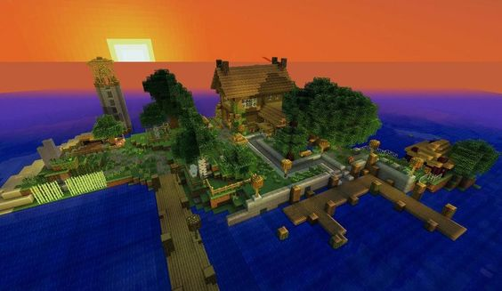

# Ethertia. <small>An Alpha Dream.</small>

_1st Generation VoxelSystem TechTest. (total 3)_

_[sorry for my plastic english]_

## 'Final Fantasy'

I want to have a software that has the freedom of building and intuitive operation like Minecraft,
the details like GTA-V, and the immersive interaction like VRChat.

Could build some buildings intuitively, conveniently and interestingly. e.g. schools, cities, theaters, subways. Could dynamically modify terrain content, items, creatures.

Could view natural landscapes, coasts, jungles, cliffs, fields, trains, or some supernatural sights. World Tree Ancient towns.

Could interact affluently with others, chat voice, custom character (modeling), optional VR interaction, motion tracking.

The ideal concept artworks I found in the internet.

<!--img src="imgs/220814.png"-->

<!--img src="imgs/d9082d9c0e5e82883043aae8b0c3a011.jpg"-->
<!--img src="imgs/ec1acaf6a49890d5752038c4d1a27172.jpg"-->
<!--img src="imgs/7cbb2d15c0f8e65dfc432f7098370946.jpg"-->
<!--img src="imgs/ac46dd62aa4bf8110d64df8764eb0c61.jpg"-->
<!--img src="imgs/f5dfa96996619239486cb8c78b3c8bc3.jpg"-->
<!--img src="imgs/e4018162a3c25415e3bf69a763f6af01.jpg"-->

<!--img src="imgs/89dc63959e41c80dd3585b8ab110d51c.jpg"-->
   
<!--img src="imgs/ee560646df4a22765e3c5a74de063040.jpg"-->      

---

I'm always on the voxel system, <strike> as evidenced by the Minecraft collaboration that wore as a kid. </strike>
When I first saw Marching Cubes [(MC1987.SIGGRAPH87)](http://kucg.korea.ac.kr/seminar/2001/src/PA-01-16.pdf)
When the algorithm is used, it is very shocking.
Later learned about Dual contouring & LoD, SVOs, which was too complicated and difficult for me to move forward.
So it is divided into 3 generations to develop, step by step experience and accumulation.

<!--
### Generation 1.
The first generation, block shape Blocky, square block Cubic Chunks (infinite xyz, height), fixed grid UnifiedGrids.
Get familiar with some basic functions (e.g. terrain generation, biomes, entities, chunks)

> [Style] Sometimes I miss 2011, Minecraft Beta 1.7.3.
> I was blown away by the Eldaria Islands (2012) map.

### Generation 2.
Second generation, Surface Profile (SurfaceNets, Introducing Density), Fixed Grid UnifiedGrids.
Familiarity with the surface voxel system
After that, I hope to achieve multi-level detail LoD and octree structure (infinite detail expansion, distant thick section simplification).

### Generation 3.
The third generation, unknown technology. Unify surfaces and sharp surfaces (Dual contouring, density introduces gradient), detailed control allows, large-scale terrain allows, simple and unified method.
Multi-level detail, octree structure.
-->

**Generation 1** _Ethertia_ - Classic Alpha: 
- Blocky, Cubical Chunks. Unified Grids.
- Explore of Terrain Generation. 
- Be little know of basic functionalities e.g. Fluid, Block-Entity, Entities. Biomes. 
- Physics: AABB-Clip & simple motion. Graphics: classical.

**Generation 2**: - Further Explore.
- Smoothly. SurfaceNets Isosurface with LoD. Unified Grids. LargeScale Terrain.
- Physics: use of BulletPhys. Graphics: advanced.

**Generation 3**: Ender Fantasy.
- Smoothness & Sharpness. Dual Contouring with LoD. SVOs. Massive Terrain.
- Unknown Technology: that supports delicated details with little spacial complexity 
  (Gradient might introduced, not batch of tiny blocks). and the historical modifies 
  shouldn't affect the performance. (not endless record of SDFs)
