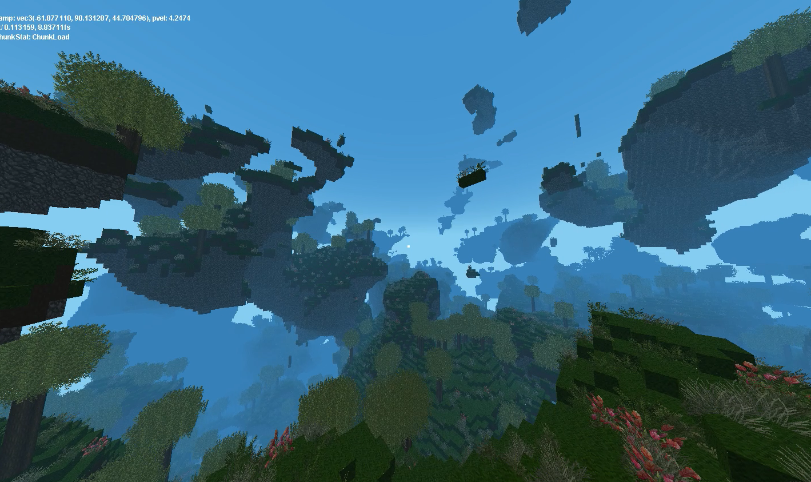

# 以太效應: <small>銀河的願望Ethertia - _An Alpha Dream_</small>

_第一代体素系统技术测试 (共3)_

## '最终幻想'

我总是在体素系统上，<strike>小时常穿的Minecraft联名衣证明了这一点。</strike>  
当我第一次看到 Marching Cubes [(MC1987. SIGGRAPH87)](http://kucg.korea.ac.kr/seminar/2001/src/PA-01-16.pdf) 
演算法时，幻想联翩。
后来在实现 Dual contouring & LoD, Octrees 时，意识到太复杂和困难了 难以推进。
所以分为3代去开发，一步步履历和积累。

羞愧的说，我想建出我的贵校。激情的说，我想在一个宏伟的自然景观 峭壁密林群山之间的河中 和朋友坐几艘船用VRChat一样方式聊天。
或是参与建筑。

### Generation 1. 
第一代, 方块外形 Blocky, 方形区块 Cubic Chunks (无限xyz,高度), 固定网格 UnifiedGrids.  
熟悉一些基本功能 (e.g. 地形生成, 生物群系, 实体, 区块)

> [风格] 有时我很怀念 2011，Minecraft Beta 1.7.3。  
> 我被 Eldaria Islands (2012) 地图深深折服。   

### Generation 2.
第二代, 曲面外形 (SurfaceNets, 引入密度), 固定网格 UnifiedGrids.  
熟悉曲面体素系统  
之后希望做到 多级细节 LoD 和 八叉树结构 (无限细节扩展, 远处粗节简化)。

### Generation 3.
第三代，未知技术。统一曲面和锐面 (Dual contouring, 密度 引入梯度), 细节控制允许, 大规模地形允许, 简单统一的方法. 
多级细节, 八叉树结构.

这一代 很多技术概念还没有确定。如果需要细节 就要舍弃效率和动态灵活性 (组合SDFs方法)。
如果需要动态灵活性 就需要舍弃细节 (传统O(1)结构)。
如何才能两者艰巨？并避免杂交算法 而是统一方法。

<!--
> Ethertia的名字由来，Ether / Skydim - 一个被取消的 Classic Minecraft 维度。 Ether - 无形又无处的Ethernet。

Aether, 以太, 根据中世纪科学，是一种渗透整个宇宙的经典元素。  
一些人相信，以太维度真实存在，只是需要正确的方法才能显现。  
现在，我已经感觉到到了。去模拟它，是我要做的事情。
-->