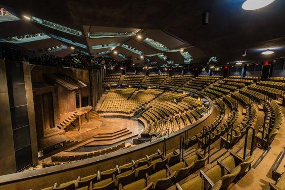
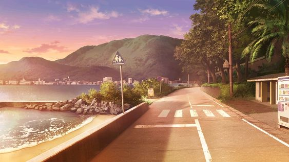
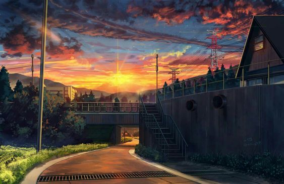

# 以太效應: <small>銀河的願望Ethertia - _An Alpha Dream_</small>

_第一代体素系统技术测试 (共3)_

## '最终幻想'

我想有一个软件，能直觉方便有趣地建一些建筑。现实中的 学校，城市，剧院，地铁。可以动态修改地形内容 物品生物。

能观赏自然景观 海岸边 密林峭壁下，田野 火车，或一些超自然的景象。世界树 远古城镇。

能与他人流畅互动，聊天 语音，自定义人物(建模)，可选的VR交互 动作追踪。

_在因特网上找到的理想的概念画图_

<!--img src="imgs/220814.png"-->

<!--img src="imgs/d9082d9c0e5e82883043aae8b0c3a011.jpg"-->
<!--img src="imgs/ec1acaf6a49890d5752038c4d1a27172.jpg"-->
<!--img src="imgs/7cbb2d15c0f8e65dfc432f7098370946.jpg"-->
<!--img src="imgs/ac46dd62aa4bf8110d64df8764eb0c61.jpg"-->
<!--img src="imgs/f5dfa96996619239486cb8c78b3c8bc3.jpg"-->
<!--img src="imgs/e4018162a3c25415e3bf69a763f6af01.jpg"-->

<!--img src="imgs/89dc63959e41c80dd3585b8ab110d51c.jpg"-->
   
<!--img src="imgs/ee560646df4a22765e3c5a74de063040.jpg"-->      

---

我总是在体素系统上，<strike>小时常穿的Minecraft联名衣证明了这一点。</strike>  
当我第一次看到 Marching Cubes [(MC1987. SIGGRAPH87)](http://kucg.korea.ac.kr/seminar/2001/src/PA-01-16.pdf) 
演算法时，很受震撼。
后来了解到 Dual contouring & LoD, SVOs，这对我太复杂和困难了 难以推进。
所以分为3代去开发，一步步履历和积累。

### Generation 1. 
第一代, 方块外形 Blocky, 方形区块 Cubic Chunks (无限xyz,高度), 固定网格 UnifiedGrids.  
熟悉一些基本功能 (e.g. 地形生成, 生物群系, 实体, 区块)

> [风格] 有时我很怀念 2011，Minecraft Beta 1.7.3。  
> 我被 Eldaria Islands (2012) 地图深深折服。   

### Generation 2.
第二代, 曲面外形 (SurfaceNets, 引入密度), 固定网格 UnifiedGrids.  
熟悉曲面体素系统  
之后希望做到 多级细节 LoD 和 八叉树结构 (无限细节扩展, 远处粗节简化)。

### Generation 3.
第三代，未知技术。统一曲面和锐面 (Dual contouring, 密度 引入梯度), 细节控制允许, 大规模地形允许, 简单统一的方法. 
多级细节, 八叉树结构.

这一代 很多技术概念还没有确定。如果需要细节 就要舍弃效率和动态灵活性 (组合SDFs方法)。
如果需要动态灵活性 就需要舍弃细节 (传统O(1)结构)。
如何才能两者艰巨？并避免杂交算法 而是统一方法。

<!--
> Ethertia的名字由来，Ether / Skydim - 一个被取消的 Classic Minecraft 维度。 Ether - 无形又无处的Ethernet。

Aether, 以太, 根据中世纪科学，是一种渗透整个宇宙的经典元素。  
一些人相信，以太维度真实存在，只是需要正确的方法才能显现。  
现在，我已经感觉到到了。去模拟它，是我要做的事情。
-->